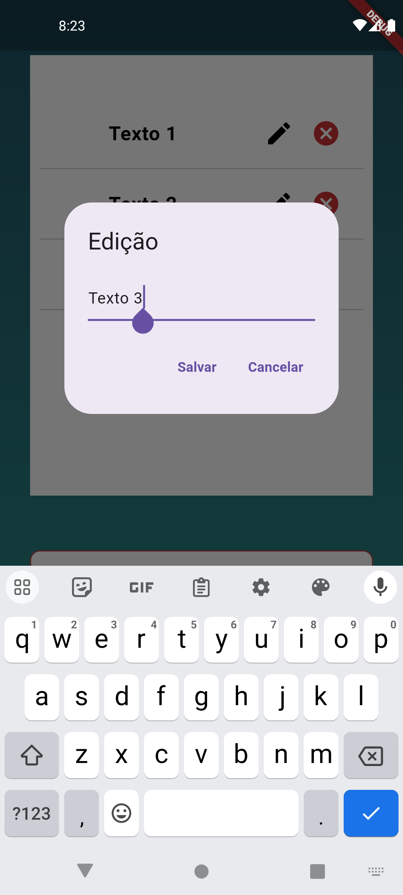

# Bem-vindo ao repertório do aplicativo Prova Flutter!
Este projeto é uma simples e eficiente tela de login com uma funcionalidade de lista de tarefas, desenvolvido para demonstrar habilidades de desenvolvimento de software.
#

# Tela de Login - LoginPage

| Imagem 1 | Imagem 2 | Imagem 3 | Imagem 4 |
|:---:|:---:|:---:|:---:|
|  |  |  |  |

Um “CustomTextFormField” representa o Login:
* Verifica e alerta se o campo “Usuário” está preenchido.
* O campo tem um limite de vinte caracteres.
* Verifica se o campo for iniciado e/ou terminado com o caractere “espaço” e retira esse caractere.

Um “CustomTextFormField” representa a Senha:
* Verifica e alerta se o campo “Senha” está preenchido; se tem menos de dois caracteres e se tem algum caractere especial, sendo apenas possível informar 'a' - 'Z' e '0' - '9'.
* O campo tem um limite de vinte caracteres.
* Verifica se o campo for iniciado e/ou terminado com o caractere espaço e retira esse caractere

Um “CustomAlign” descrito "Política de privacidade":
* Ao ser tocado o usuário é direcionada para a página [google.com.br](https://www.google.com.br/).

Com ambas (Usuário e Senha) as informações preenchidas e estando dentro dos requisitos é possível ir para a próxima tela.

#

  
# Tela de captura de informações

| Imagem 1 | Imagem 2 | Imagem 3 | Imagem 4 |
|:---:|:---:|:---:|:---:|
|  |  |  |  |

TodoPage
* Utilizado o plugin MobX (versão 2.2.3) para a construção da tela.
* As informações são salvas e lidas utilizando a biblioteca shared_preferences (versão: 2.2.2).

Um “Observer” contendo um “Container” para a visualização da lista:
* Os textos digitados tem as opções de edição e excluir.
* O Icone de excluir e o Icone de edição abre um pop-up confirmando ou cancelando a ação.
* A lista salva as informações digitadas pelo usuário, mesmo se o aplicativo for fechado, quando aberto as informações não são perdidas.

Um “CustomTextFormField” para a digitação do texto:
* O foco da digitação está o tempo todo no campo de "Digite seu texto" e não é perdido ao interagir com a tela.
* Ao acionar a tecla "enter" o campo verifica e alerta foi preenchido caso esteja dentro do esperado a informação entra na lista e aparece no card principal.

 Um “CustomAlign” descrito "Política de privacidade":
* Ao ser tocado o usuário é direcionada para a página “google.com.br”.
